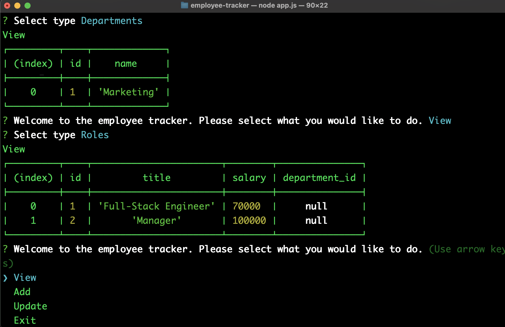

# Employee Tracker

  ## Description

  A command line Node application for tracking employee data. The app allows the user to create, store and update employees, employment roles and departments. The app stores the employee data in a MySQL database.

  ## Table of Contents

  * [Image](#image)
  * [Technologies](#technologies)
  * [Known-Bugs](#known-bugs)
  * [Next-Steps](#next-steps)
  * [License](#license)
  * [Contact](#contact)
  * [Links](#links)

  ## Image

  

  ## Technologies
  
  * Javascript
  * Node.js
  * MySQL

  ## Known-Bugs

  Some bugs in navgating through the menu. There also appears to be a bug on exit that can be resolved by pressing enter one more time for the app to quit.

  ## Next-Steps

  The app for now the update function can only update the employee role. Will need a way to update the role with a department id as well as deleting entries.

  ## License

  This project is licensed under the [MIT](https://opensource.org/licenses/MIT) license.
  

  ## Contact

  Author: Ray Luna 

  If you have any questions about the repo, open an issue or contact me directly at:
  - E-Mail: leon.luna.ray@gmail.com
  - GitHub: [leon-luna-ray](https://github.com/leon-luna-ray)

  ## Links

  - [Deployed Project]() 

  - [Project Repository](https://github.com/leon-luna-ray/employee-tracker)

  